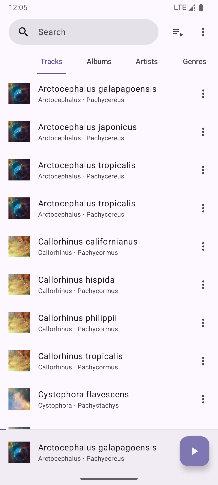
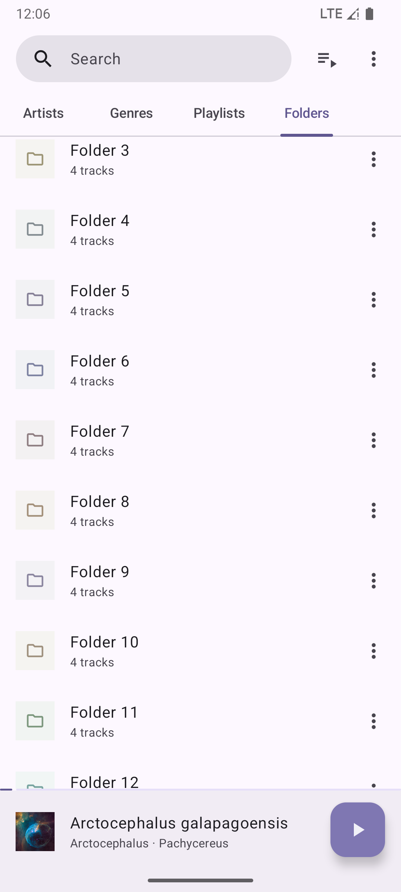
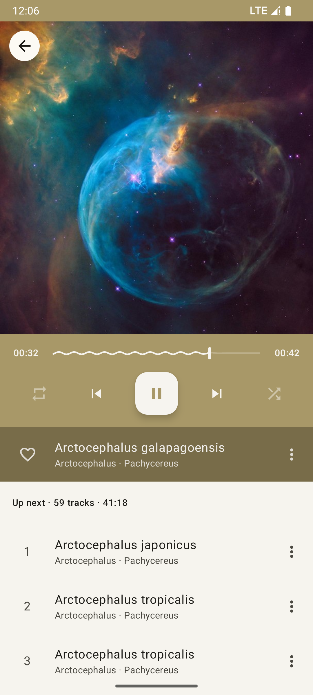

= Phocid (Fork)
:note-caption: ℹ️
:warning-caption: ⚠️

image:https://img.shields.io/github/license/tjysunset/phocid[License]

این یک فورک از https://github.com/TJYSunset/Phocid[Phocid] است که قابلیت‌های اضافی به آن اضافه شده است.

image:metadata/en-US/images/phoneScreenshots/01-screenshot-home-albums.png[Screenshot,15%]

image:metadata/en-US/images/phoneScreenshots/03-screenshot-search.png[Screenshot,15%]

یک پخش‌کننده موسیقی آفلاین مدرن با طراحی آشنا برای اندروید ۱۱ به بالا.

== قابلیت‌های اضافه شده در این فورک

* *ویرایش تگ‌های صوتی* - امکان ویرایش متادیتای فایل‌های صوتی شامل:
** عنوان، آرتیست، آلبوم، آرتیست آلبوم
** ژانر، سال، شماره ترک، شماره دیسک
** کامنت و متن آهنگ (lyrics)
** پشتیبانی از فرمت‌های: MP3, FLAC, OGG, M4A, MP4, WMA, WAV, AIF, AIFF, DSF
* *اسکن خودکار کتابخانه* - پس از ویرایش تگ‌ها، کتابخانه به صورت خودکار بروزرسانی می‌شود

== قابلیت‌های اصلی Phocid

* تجربه کاربری آشنا
* پشتیبانی بهتر از متادیتا؛ به خصوص چند آرتیست
* مرتب‌سازی بهتر وقتی زبان کتابخانه موسیقی با زبان سیستم متفاوت است
* بلاک‌لیست مبتنی بر Regex
* کنترل سرعت و pitch پخش
* سبک‌های مختلف نمایش متن آهنگ
* رنگ‌های کم‌رنگ‌تر اختیاری
* طراحی جدید بر اساس Material Design 3

== ساخت پروژه

برای کلون کردن با ساب‌ماژول:
[source,bash]
----
git clone --recurse-submodules https://github.com/CertMusashi/music-player.git
----

== لایسنس

....
Phocid
Copyright (C) tjysunset <tjysunset@outlook.com>

This program is free software: you can redistribute it and/or modify it under the terms of the GNU General Public License as published by the Free Software Foundation, either version 3 of the License, or (at your option) any later version.

This program is distributed in the hope that it will be useful, but WITHOUT ANY WARRANTY; without even the implied warranty of MERCHANTABILITY or FITNESS FOR A PARTICULAR PURPOSE. See the GNU General Public License for more details.

You should have received a copy of the GNU General Public License along with this program. If not, see <https://www.gnu.org/licenses/>.
....
